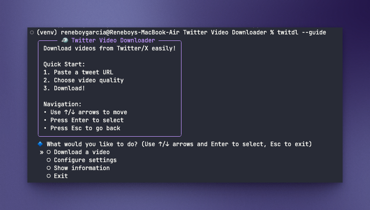

# Start Generation Here


# Twitter Video Downloader

This tool helps you download videos from Twitter/X using `yt-dlp`. It's designed to be easy to use and deploy.

## 🚀 Quick Deployment

To get started with the Twitter Video Downloader, follow these steps:

1. **Run the Makefile**: This will execute the commands defined in the Makefile, which typically includes installing dependencies and setting up the environment. You can do this by running:
   ```
   make dev-setup
   ```

2. **Activate the Virtual Environment**: Before running the tool, ensure that your virtual environment is activated. This isolates your project's dependencies. You can activate it with:
   ```
   source venv/bin/activate  # On macOS/Linux
   .\venv\Scripts\activate   # On Windows
   ```

3. **Run the Tool with the Guide Option**: Finally, you can run the Twitter Video Downloader with the guide option to see usage instructions and available commands:
   ```
   twitdl --guide
   ```
## ⬇️⬇️ Example

To test the tool, you can use the following sample link: https://x.com/MIT_CSAIL/status/1363172815315214336

By following these steps, you will be able to set up and use the Twitter Video Downloader effectively.

