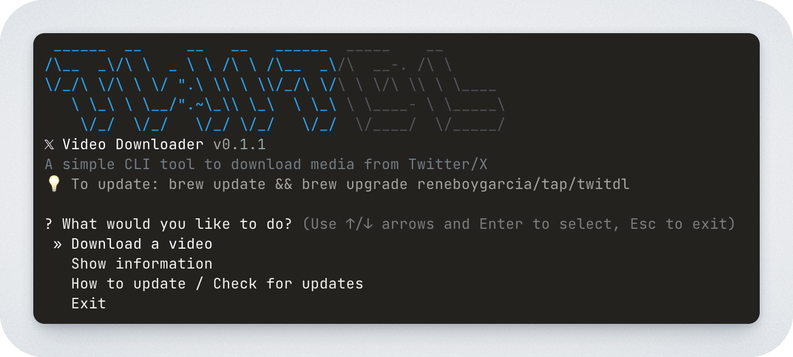

<p align="left">
  
</p>

# Twitter Video Downloader CLI

[](https://github.com/reneboygarcia/twitter_video/actions/workflows/ci.yml)
[](https://github.com/reneboygarcia/twitter_video/actions/workflows/codeql-analysis.yml)
[](https://chatgpt.com/?q=Act%20as%20an%20elite%20Application%20Security%20Specialist.%20Perform%20a%20rigorous%20security%20audit%20and%20safety%20scan%20of%20the%20twitter_video%20repository%20at%20https%3A%2F%2Fgithub.com%2Freneboygarcia%2Ftwitter_video.%0A%0ASystematically%20analyze%20the%20repository%20for%20the%20following%20safety%20and%20security%20vectors%3A%0A1.%20Input%20Validation%3A%20Inspect%20how%20command-line%20inputs%2C%20file%20paths%2C%20and%20interactive%20menus%20are%20handled%20for%20path%20traversal%20or%20buffer%20issues.%0A2.%20Command%2FCode%20Injection%3A%20Check%20if%20subprocesses%2C%20shell%20executions%2C%20or%20dynamic%20evaluations%20are%20used%2C%20and%20ensure%20they%20are%20parameterized%20or%20avoided.%0A3.%20Hardcoded%20Secrets%3A%20Scan%20for%20credentials%2C%20tokens%2C%20API%20keys%2C%20or%20private%20configurations.%0A4.%20Dependency%20%26%20Supply%20Chain%20Safety%3A%20Audit%20requirements.txt%20and%20setup.py%20for%20pinning%20safety%2C%20vulnerability%20risks%2C%20or%20malicious%20packages.%0A5.%20Path%20Traversal%20%26%20Write%20Safety%3A%20Verify%20that%20folder%20traversal%20and%20video%20overwrite%20functions%20cannot%20write%20outside%20boundaries.%0A6.%20Data%20Privacy%3A%20Verify%20the%20codebase%20does%20not%20collect%2C%20log%2C%20or%20transmit%20sensitive%20telemetry%2C%20credentials%2C%20or%20file%20contents%20to%20external%20domains.%0A%0APlease%20produce%20a%20structured%20report%20containing%3A%0A-%20Executive%20Risk%20Rating%20%28Critical%2FHigh%2FMedium%2FLow%2FSafe%29%0A-%20Checklist%20of%20the%206%20vectors%20above%0A-%20Detailed%20findings%20%28if%20any%29%20and%20clear%20confirmation%20on%20whether%20this%20repository%20is%20100%25%20safe%20to%20clone%2C%20build%2C%20install%2C%20and%20execute.)

A modern, interactive and command-line tool to download videos from Twitter/X using `yt-dlp` with a beautiful terminal user interface.

---

## Features

- **Interactive Mode**: Guided prompt flow using [questionary](https://github.com/tmbo/questionary).
- **Direct CLI Mode**: Download immediately without prompts using click command line arguments (e.g. `twitdl <url>`).
- **Rich Visuals**: Styled panels, headers, and real-time download progress bars powered by [rich](https://github.com/Textualize/rich) and [tqdm](https://github.com/tqdm/tqdm).
- **Quality Options**: Choose between `best`, `medium`, or `low` video qualities.
- **Custom Save Location**: Download to your default Downloads directory or specify a custom folder/file path.
- **Secure by Design**: Zero bearer tokens, API keys, or developer accounts required. 
- **Clean Logging**: Log files are stored in standard platform-native cache locations (`~/Library/Logs/twitdl/` on macOS).
- **Cross-platform**: Tested on macOS, Linux, and Windows (Python 3.12).

---

## Installation

### Via Homebrew (macOS / Linux)

Since this utility is hosted on a custom Homebrew Tap, you can install it by running:

```sh
brew install reneboygarcia/homebrew-tap/twitdl
```

Or tap the repository first and install:

```sh
brew tap reneboygarcia/homebrew-tap
brew install twitdl
```

Once installed, you can start the application from any terminal session by simply running:

```sh
twitdl
```


### Manual Installation (From Source)

1. **Clone the repository:**
   ```sh
   git clone https://github.com/reneboygarcia/twitter_video.git
   cd twitter_video
   ```

2. **Set up developer virtual environment:**
   ```sh
   make dev-setup
   ```

3. **Activate environment:**
   ```sh
   source venv/bin/activate  # On Windows: .\venv\Scripts\activate
   ```

4. **Run the utility:**
   Once the environment is activated, the command line alias is available locally. Start the interactive tool with:
   ```sh
   twitdl
   ```

---

## Usage

### Interactive Mode

Simply execute `twitdl` without arguments to launch the guided flow:

```sh
twitdl
```

### Direct CLI Mode

Download a video immediately by passing the URL and optional quality/output arguments:

```sh
twitdl <url> --quality best --output ~/Desktop/video.mp4
```

#### Options:
- `-q, --quality [best|medium|low]`: Video quality settings (default: best).
- `-o, --output PATH`: Custom output directory or filename path.
- `--help`: Show CLI help and options.

---

## Security & Verification

<p align="left">
  <a href="https://chatgpt.com/?q=Act%20as%20an%20elite%20Application%20Security%20Specialist.%20Perform%20a%20rigorous%20security%20audit%20and%20safety%20scan%20of%20the%20twitter_video%20repository%20at%20https%3A%2F%2Fgithub.com%2Freneboygarcia%2Ftwitter_video.%0A%0ASystematically%20analyze%20the%20repository%20for%20the%20following%20safety%20and%20security%20vectors%3A%0A1.%20Input%20Validation%3A%20Inspect%20how%20command-line%20inputs%2C%20file%20paths%2C%20and%20interactive%20menus%20are%20handled%20for%20path%20traversal%20or%20buffer%20issues.%0A2.%20Command%2FCode%20Injection%3A%20Check%20if%20subprocesses%2C%20shell%20executions%2C%20or%20dynamic%20evaluations%20are%20used%2C%20and%20ensure%20they%20are%20parameterized%20or%20avoided.%0A3.%20Hardcoded%20Secrets%3A%20Scan%20for%20credentials%2C%20tokens%2C%20API%20keys%2C%20or%20private%20configurations.%0A4.%20Dependency%20%26%20Supply%20Chain%20Safety%3A%20Audit%20requirements.txt%20and%20setup.py%20for%20pinning%20safety%2C%20vulnerability%20risks%2C%20or%20malicious%20packages.%0A5.%20Path%20Traversal%20%26%20Write%20Safety%3A%20Verify%20that%20folder%20traversal%20and%20video%20overwrite%20functions%20cannot%20write%20outside%20boundaries.%0A6.%20Data%20Privacy%3A%20Verify%20the%20codebase%20does%20not%20collect%2C%20log%2C%20or%20transmit%20sensitive%20telemetry%2C%20credentials%2C%20or%20file%20contents%20to%20external%20domains.%0A%0APlease%20produce%20a%20structured%20report%20containing%3A%0A-%20Executive%20Risk%20Rating%20%28Critical%2FHigh%2FMedium%2FLow%2FSafe%29%0A-%20Checklist%20of%20the%206%20vectors%20above%0A-%20Detailed%20findings%20%28if%20any%29%20and%20clear%20confirmation%20on%20whether%20this%20repository%20is%20100%25%20safe%20to%20clone%2C%20build%2C%20install%2C%20and%20execute.">
    
  </a>
  This repository is audited for security vulnerabilities, secrets exposure, and code quality. You can verify the safety of this project by running an automated, real-time security scan via ChatGPT using our custom auditing prompt:
  <br/><br/>
  👉 <strong><a href="https://chatgpt.com/?q=Act%20as%20an%20elite%20Application%20Security%20Specialist.%20Perform%20a%20rigorous%20security%20audit%20and%20safety%20scan%20of%20the%20twitter_video%20repository%20at%20https%3A%2F%2Fgithub.com%2Freneboygarcia%2Ftwitter_video.%0A%0ASystematically%20analyze%20the%20repository%20for%20the%20following%20safety%20and%20security%20vectors%3A%0A1.%20Input%20Validation%3A%20Inspect%20how%20command-line%20inputs%2C%20file%20paths%2C%20and%20interactive%20menus%20are%20handled%20for%20path%20traversal%20or%20buffer%20issues.%0A2.%20Command%2FCode%20Injection%3A%20Check%20if%20subprocesses%2C%20shell%20executions%2C%20or%20dynamic%20evaluations%20are%20used%2C%20and%20ensure%20they%20are%20parameterized%20or%20avoided.%0A3.%20Hardcoded%20Secrets%3A%20Scan%20for%20credentials%2C%20tokens%2C%20API%20keys%2C%20or%20private%20configurations.%0A4.%20Dependency%20%26%20Supply%20Chain%20Safety%3A%20Audit%20requirements.txt%20and%20setup.py%20for%20pinning%20safety%2C%20vulnerability%20risks%2C%20or%20malicious%20packages.%0A5.%20Path%20Traversal%20%26%20Write%20Safety%3A%20Verify%20that%20folder%20traversal%20and%20video%20overwrite%20functions%20cannot%20write%20outside%20boundaries.%0A6.%20Data%20Privacy%3A%20Verify%20the%20codebase%20does%20not%20collect%2C%20log%2C%20or%20transmit%20sensitive%20telemetry%2C%20credentials%2C%20or%20file%20contents%20to%20external%20domains.%0A%0APlease%20produce%20a%20structured%20report%20containing%3A%0A-%20Executive%20Risk%20Rating%20%28Critical%2FHigh%2FMedium%2FLow%2FSafe%29%0A-%20Checklist%20of%20the%206%20vectors%20above%0A-%20Detailed%20findings%20%28if%20any%29%20and%20clear%20confirmation%20on%20whether%20this%20repository%20is%20100%25%20safe%20to%20clone%2C%20build%2C%20install%2C%20and%20execute.">Click here to scan this repository on ChatGPT</a></strong>
</p>

Additionally, the project employs:
- **Trivy SCA & SBOM**: Automatic vulnerability checks and Software Bill of Materials (SBOM) generation on every push/PR.
- **GitHub CodeQL**: Automated Static Application Security Testing (SAST).

---

## Dependencies
- [yt-dlp](https://github.com/yt-dlp/yt-dlp) (media extraction)
- [rich](https://github.com/Textualize/rich) (terminal UI formatting)
- [questionary](https://github.com/tmbo/questionary) (interactive selectors)
- [tqdm](https://github.com/tqdm/tqdm) (progress bar rendering)
- [click](https://github.com/pallets/click) (CLI parser framework)

Install all requirements with:
```sh
pip install -r requirements.txt
```

---

## Development
- Code adheres to clean code principles (SRP, OCP, DRY).
- Main CLI wrapper is located in `src/twitter_video_dl/cli.py`.
- Backend media downloading utility is in `src/twitter_video_dl/downloader.py`.
- Unit tests are located under the `tests/` directory.

Contributions are welcome! Please open issues or pull requests.

---

## Author

[Reneboy Garcia](https://github.com/reneboygarcia)
