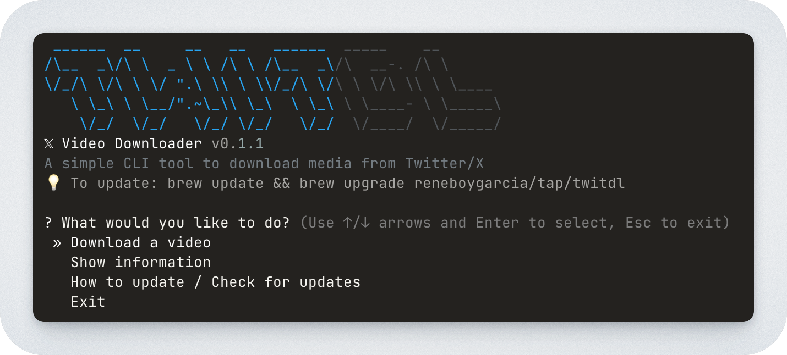

<p align="left">
  
</p>

# Twitter video downloader CLI

[](https://github.com/reneboygarcia/twitter_video/actions/workflows/ci.yml)
[](https://github.com/reneboygarcia/twitter_video/actions/workflows/codeql-analysis.yml)
[](https://chatgpt.com/?q=Act%20as%20an%20elite%20Application%20Security%20Specialist.%20Perform%20a%20rigorous%20security%20audit%20and%20safety%20scan%20of%20the%20twitter_video%20repository%20at%20https%3A%2F%2Fgithub.com%2Freneboygarcia%2Ftwitter_video.%0A%0ASystematically%20analyze%20the%20repository%20for%20the%20following%20safety%20and%20security%20vectors%3A%0A1.%20Input%20Validation%3A%20Inspect%20how%20command-line%20inputs%2C%20file%20paths%2C%20and%20interactive%20menus%20are%20handled%20for%20path%20traversal%20or%20buffer%20issues.%0A2.%20Command%2FCode%20Injection%3A%20Check%20if%20subprocesses%2C%20shell%20executions%2C%20or%20dynamic%20evaluations%20are%20used%2C%20and%20ensure%20they%20are%20parameterized%20or%20avoided.%0A3.%20Hardcoded%20Secrets%3A%20Scan%20for%20credentials%2C%20tokens%2C%20API%20keys%2C%20or%20private%20configurations.%0A4.%20Dependency%20%26%20Supply%20Chain%20Safety%3A%20Audit%20Cargo.toml%20and%20Cargo.lock%20for%20pinning%20safety%2C%20vulnerability%20risks%2C%20or%20malicious%20crates.%0A5.%20Path%20Traversal%20%26%20Write%20Safety%3A%20Verify%20that%20folder%20traversal%20and%20video%20overwrite%20functions%20cannot%20write%20outside%20boundaries.%0A6.%20Data%20Privacy%3A%20Verify%20the%20codebase%20does%20not%20collect%2C%20log%2C%20or%20transmit%20sensitive%20telemetry%2C%20credentials%2C%20or%20file%20contents%20to%20external%20domains.%0A%0APlease%20produce%20a%20structured%20report%20containing%3A%0A-%20Executive%20Risk%20Rating%20%28Critical%2FHigh%2FMedium%2FLow%2FSafe%29%0A-%20Checklist%20of%20the%206%20vectors%20above%0A-%20Detailed%20findings%20%28if%20any%29%20and%20clear%20confirmation%20on%20whether%20this%20repository%20is%20100%25%20safe%20to%20clone%2C%20build%2C%20install%2C%20and%20execute.)

A command-line tool written in Rust to download videos from Twitter and X using `yt-dlp`.

For details on why we migrated from Python to Rust, read the [Rust Transition Report](docs/RUST_TRANSITION.md).

---

## Features

- **Interactive mode**: Guided prompt flow powered by inquire.
- **Direct command mode**: Download media immediately by passing a tweet URL (e.g., `twitdl <url>`).
- **Progress indicator**: Real-time progress bars powered by indicatif.
- **Quality selection**: Select `best`, `medium`, or `low` video quality.
- **Custom output path**: Save files to your Downloads directory or specify a custom output path.
- **Built-in update command**: Run `twitdl update` to check for updates and upgrade your installation.
- **Shell completions**: Generate completion scripts for Zsh, Bash, Fish, or PowerShell.
- **Safety checks**: Restricts write access to system directories and cleans up incomplete download files on exit.
- **Platform support**: Runs on macOS, Linux, and Windows.

---

## Performance comparison

We rewrote the command-line tool in Rust to reduce startup overhead and binary size.

* **Startup time**: Reduced from 364 ms in Python to 6.3 ms in Rust.
* **Binary size**: Reduced from 20.0 MB to 3.75 MB as a standalone binary.

---

## Quick Start

**Install via Homebrew Tap**

```bash
brew tap reneboygarcia/tap
brew trust reneboygarcia/tap
brew install twitdl
```

**Or via script**

```bash
curl -fsSL https://raw.githubusercontent.com/reneboygarcia/twitter_video/main/install.sh | bash
```

**Run**

```bash
twitdl                                                          # Interactive menu
twitdl <tweet-url>                                              # Direct download (best quality)
twitdl <tweet-url> --quality best --output ~/Desktop/video.mp4  # Custom quality and output path
twitdl update                                                   # Check for updates and upgrade
twitdl update --check-only                                      # Check for updates without upgrading
twitdl completions zsh                                          # Shell tab completion for Zsh
twitdl --help                                                   # Show help text
twitdl --version                                                # Show version information
```

<details>
<summary><strong>Manual installation from source</strong></summary>

### Prerequisites
1. **Rust toolchain**: Install Rust and Cargo from [rust-lang.org](https://www.rust-lang.org/tools/install).
2. **Subprocess dependency**: Install `yt-dlp` on your system so it is available in your PATH.

### Installation steps
```bash
git clone https://github.com/reneboygarcia/twitter_video.git
cd twitter_video
cargo build --release
cargo install --path .
```

</details>

---

## Command options

- `-q, --quality <QUALITY>`: Video quality settings (`best`, `medium`, `low`).
- `-o, --output <PATH>`: Custom output directory or file path.
- `-g, --guide`: Force interactive guided mode.
- `-u, --update`: Check for updates and upgrade.
- `-V, --version`: Print version information.
- `-h, --help`: Show help text.

---

## Updating and upgrading

You can check for updates and upgrade your installation directly from the terminal.

Run the update command:

```sh
twitdl update
```

If you installed the tool through Homebrew, `twitdl update` will run `brew upgrade reneboygarcia/tap/twitdl` for you.

To check for available updates without performing an upgrade, run:

```sh
twitdl update --check-only
```

---

## Shell completions

You can generate shell completion scripts for your shell.

To generate completions for Zsh, run:

```sh
twitdl completions zsh > ~/.zsh/completion/_twitdl
```

Supported shell options are `zsh`, `bash`, `fish`, and `powershell`.

---

## Security and verification

[](https://chatgpt.com/?q=Act%20as%20an%20elite%20Application%20Security%20Specialist.%20Perform%20a%20rigorous%20security%20audit%20and%20safety%20scan%20of%20the%20twitter_video%20repository%20at%20https%3A%2F%2Fgithub.com%2Freneboygarcia%2Ftwitter_video.%0A%0ASystematically%20analyze%20the%20repository%20for%20the%20following%20safety%20and%20security%20vectors%3A%0A1.%20Input%20Validation%3A%20Inspect%20how%20command-line%20inputs%2C%20file%20paths%2C%20and%20interactive%20menus%20are%20handled%20for%20path%20traversal%20or%20buffer%20issues.%0A2.%20Command%2FCode%20Injection%3A%20Check%20if%20subprocesses%2C%20shell%20executions%2C%20or%20dynamic%20evaluations%20are%20used%2C%20and%20ensure%20they%20are%20parameterized%20or%20avoided.%0A3.%20Hardcoded%20Secrets%3A%20Scan%20for%20credentials%2C%20tokens%2C%20API%20keys%2C%20or%20private%20configurations.%0A4.%20Dependency%20%26%20Supply%20Chain%20Safety%3A%20Audit%20Cargo.toml%20and%20Cargo.lock%20for%20pinning%20safety%2C%20vulnerability%20risks%2C%20or%20malicious%20crates.%0A5.%20Path%20Traversal%20%26%20Write%20Safety%3A%20Verify%20that%20folder%20traversal%20and%20video%20overwrite%20functions%20cannot%20write%20outside%20boundaries.%0A6.%20Data%20Privacy%3A%20Verify%20the%20codebase%20does%20not%20collect%2C%20log%2C%20or%20transmit%20sensitive%20telemetry%2C%20credentials%2C%20or%20file%20contents%20to%20external%20domains.%0A%0APlease%20produce%20a%20structured%20report%20containing%3A%0A-%20Executive%20Risk%20Rating%20%28Critical%2FHigh%2FMedium%2FLow%2FSafe%29%0A-%20Checklist%20of%20the%206%20vectors%20above%0A-%20Detailed%20findings%20%28if%20any%29%20and%20clear%20confirmation%20on%20whether%20this%20repository%20is%20100%25%20safe%20to%20clone%2C%20build%2C%20install%2C%20and%20execute.)

This repository is routinely audited for security vulnerabilities, secrets exposure, and code quality. You can verify the safety of this project by running an automated, real-time security scan via ChatGPT using our custom auditing prompt:

👉 **[Click here to scan this repository on ChatGPT](https://chatgpt.com/?q=Act%20as%20an%20elite%20Application%20Security%20Specialist.%20Perform%20a%20rigorous%20security%20audit%20and%20safety%20scan%20of%20the%20twitter_video%20repository%20at%20https%3A%2F%2Fgithub.com%2Freneboygarcia%2Ftwitter_video.%0A%0ASystematically%20analyze%20the%20repository%20for%20the%20following%20safety%20and%20security%20vectors%3A%0A1.%20Input%20Validation%3A%20Inspect%20how%20command-line%20inputs%2C%20file%20paths%2C%20and%20interactive%20menus%20are%20handled%20for%20path%20traversal%20or%20buffer%20issues.%0A2.%20Command%2FCode%20Injection%3A%20Check%20if%20subprocesses%2C%20shell%20executions%2C%20or%20dynamic%20evaluations%20are%20used%2C%20and%20ensure%20they%20are%20parameterized%20or%20avoided.%0A3.%20Hardcoded%20Secrets%3A%20Scan%20for%20credentials%2C%20tokens%2C%20API%20keys%2C%20or%20private%20configurations.%0A4.%20Dependency%20%26%20Supply%20Chain%20Safety%3A%20Audit%20Cargo.toml%20and%20Cargo.lock%20for%20pinning%20safety%2C%20vulnerability%20risks%2C%20or%20malicious%20crates.%0A5.%20Path%20Traversal%20%26%20Write%20Safety%3A%20Verify%20that%20folder%20traversal%20and%20video%20overwrite%20functions%20cannot%20write%20outside%20boundaries.%0A6.%20Data%20Privacy%3A%20Verify%20the%20codebase%20does%20not%20collect%2C%20log%2C%20or%20transmit%20sensitive%20telemetry%2C%20credentials%2C%20or%20file%20contents%20to%20external%20domains.%0A%0APlease%20produce%20a%20structured%20report%20containing%3A%0A-%20Executive%20Risk%20Rating%20%28Critical%2FHigh%2FMedium%2FLow%2FSafe%29%0A-%20Checklist%20of%20the%206%20vectors%20above%0A-%20Detailed%findings%20%28if%20any%29%20and%20clear%20confirmation%20on%20whether%20this%20repository%20is%20100%25%20safe%20to%20clone%2C%20build%2C%20install%2C%20and%20execute.)**

- **Automated scanning**: Trivy scans for dependency vulnerabilities and generates Software Bill of Materials (SBOM) files on every build.
- **CodeQL analysis**: GitHub CodeQL runs static code analysis on pushes and pull requests.
- **Input validation**: The application prevents path traversal attempts and blocks writing to system folders.

---

## Development

Developer workflows are defined in the [Makefile](Makefile).

- Main CLI entry point: [src/main.rs](src/main.rs)
- Media download engine: [src/downloader.rs](src/downloader.rs)
- Update checker module: [src/update_checker.rs](src/update_checker.rs)
- Integration test suite: [tests/](tests/)

---

## Author

[Reneboy Garcia](https://github.com/reneboygarcia)
